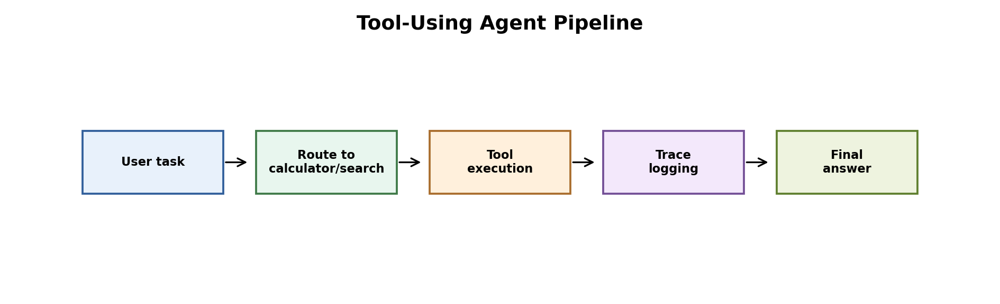
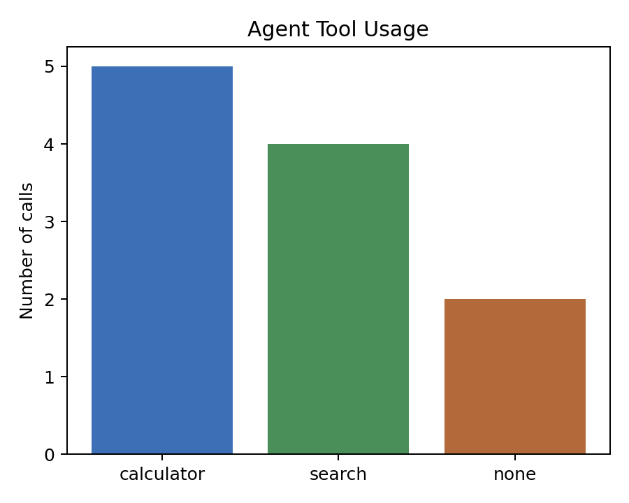
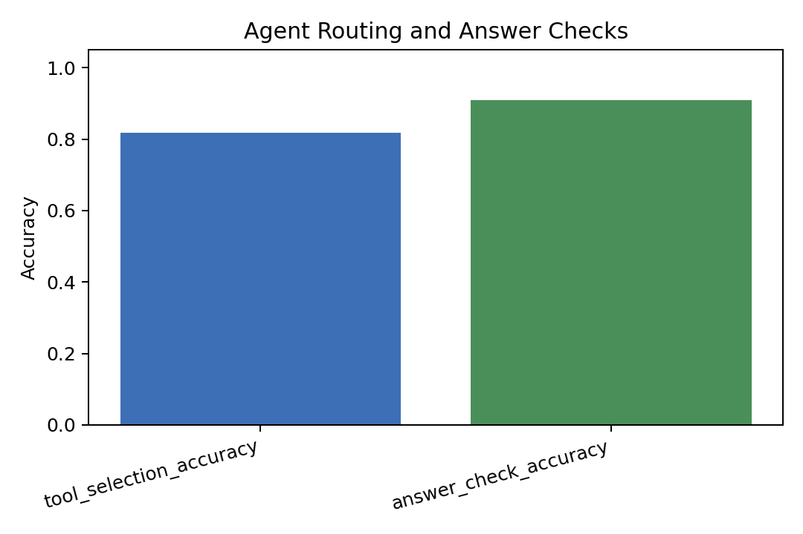

# Tool-Using Agent Calculator and Search Demo



Figure: a simple agent routes questions to a calculator, a search tool, or no tool when the task is unsupported.

## Motivation

Tool-using agents should be evaluated on both successful calls and failure cases. A demo that only shows correct examples hides the hardest part of agent design: deciding when a tool is needed and when the available tools are not enough.

## Project Goal

We built a small rule-based agent that chooses among:

- Calculator
- Search over a small local knowledge base
- No tool / needs more information

We then measured tool-selection accuracy and answer-check accuracy.

## Dataset

The evaluation contains 11 tasks. Some are clean calculator or search tasks, while others are ambiguous or unsupported. The ambiguous examples are important because they reveal routing mistakes.

## Tools

Python, pandas, matplotlib, and safe Python AST parsing for arithmetic expressions.

## Method

The agent uses simple routing rules. Calculator expressions are evaluated with a restricted AST evaluator. Search queries are matched against local documents about FedAvg, RAG, Edge AI, quantization, and pruning.

## Results

| Metric | Value |
|---|---:|
| Tasks | 11 |
| Tool selection accuracy | 0.8182 |
| Answer check accuracy | 0.9091 |
| Failure/no-tool cases | 2 |





Result files:

- `results/agent_trace.csv`
- `results/tool_usage.csv`
- `results/agent_metrics.csv`

## Interpretation

The agent handles simple calculator and search tasks, but it fails on an ambiguous question that contains a number and a knowledge request. The router sees the number and chooses the calculator even though search would be more appropriate.

This is a useful failure. It shows why real tool agents need better intent classification, tool schemas, validation, and fallback behavior.

## Conclusion

The project now includes both successes and limitations. The next step is to replace the hand-written router with a learned or LLM-based router and evaluate it on a larger task set.

## How To Run

```bash
pip install -r requirements.txt
python 1_tool_using_agent_demo.py
```
